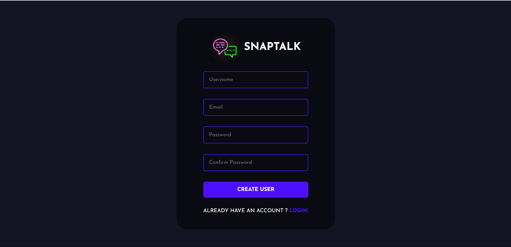
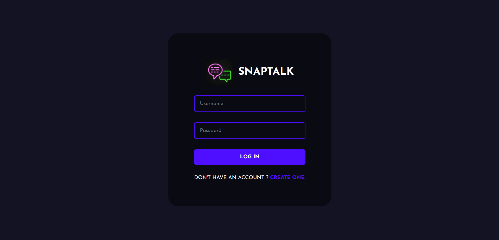
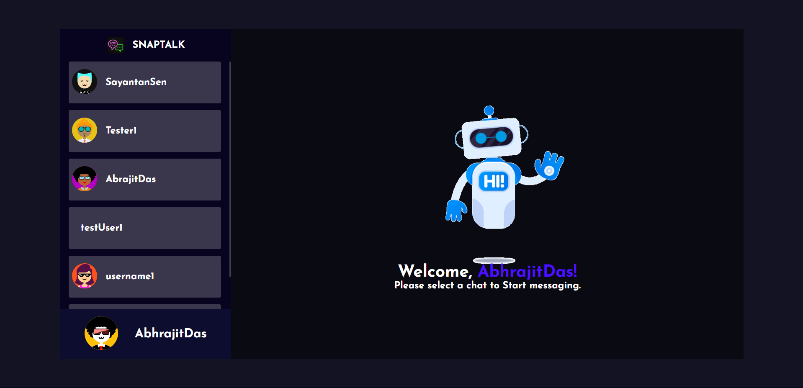
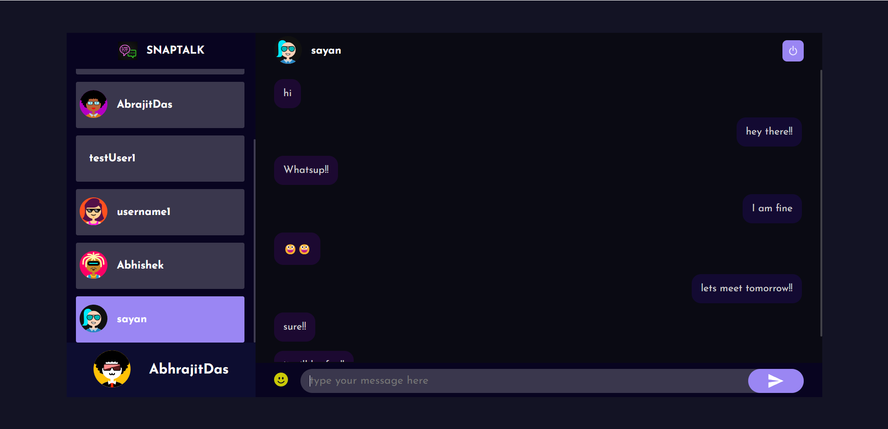
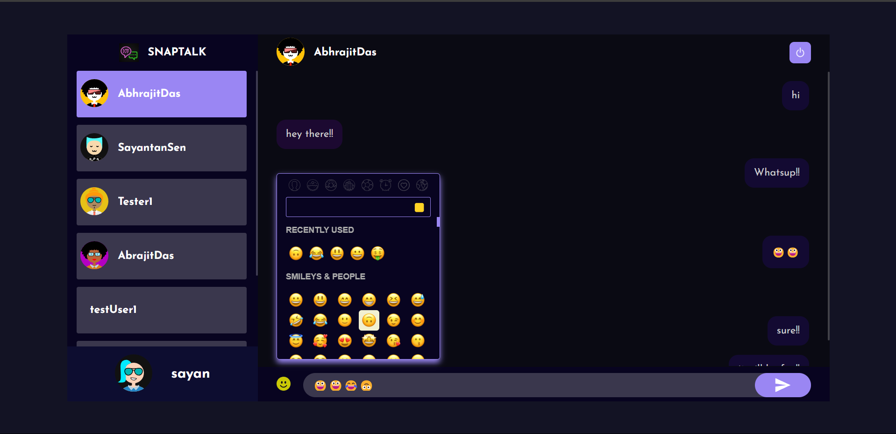

<h1 align="center">SnapTalk</h1>
<h5 align="center">"Connect instantly and effortlessly with friends and family on our user-friendly chatting platform!"</h5>

<hr>


# Project Overview

An online platform where individuals can send text, emojis and messages to each other in real time. This Chat Application allows the users to login and choose an unique avatar as their Profile DP.This project uses ReactJs for the frontend and NodeJs(Express) for Backend Server and MongoDb as Database. 

# Web Application

This javascript based application allows users to create an account on the site,send and receive text messages along with emojis in real time, helps them to stay connected with their favourite persons,family and friends.

New Users can Sign-up in the website through the Register page giving their username,email and password.Moreover a user can chhose  his/her favourite avatar as thier profile picture which will be displayed along with their name.


## Project Contributors

- [@Sayantan Sen](https://github.com/Sayantan-Sen-2003)

- [@Abhrajit Das](https://github.com/Abhrajitdas02)
 

## Documentation
Frontend-

[ReactJs](https://react.dev/blog/2023/03/16/introducing-react-dev)
[TailwindCss](https://v2.tailwindcss.com/docs)


Backend-

[NodeJs](https://nodejs.org/docs/latest/api/)
[ExpressJs](https://devdocs.io/express/)
[MongoDb](https://www.mongodb.com/docs/)


## Environment Variables

To run this project, you will need to add the following environment variables to your .env file.

For BACKEND (In Server Directory)-

`MONGO`

`PORT`

For FrontEnd (In public Folder)-

`REACT_APP_LOCALHOST_KEY`

## Node modules installation

To install the node modules used in the project,

```bash
  npm i 
```
or

```bash
  npm install 
```

in both public directory (frontend) &
in server directory(backend server)


## Run Command

To run this project in local server,

```bash
  npm run start
```
in both public directory (frontend) &
in server directory(backend server)

## TECHNOLOGY STACK

FRONTEND


BACKEND


## Features

- Login Page via username-password 
- register Page for new Users to sign-up in our website.
- Option to choose a avatar as thier DP of thier account.
- A text input field to type and send text messages and emojis in real time.
- Logout functionality
- Backend encrypted database for user details,passwords,chats,avatar .


## Website Preview 




